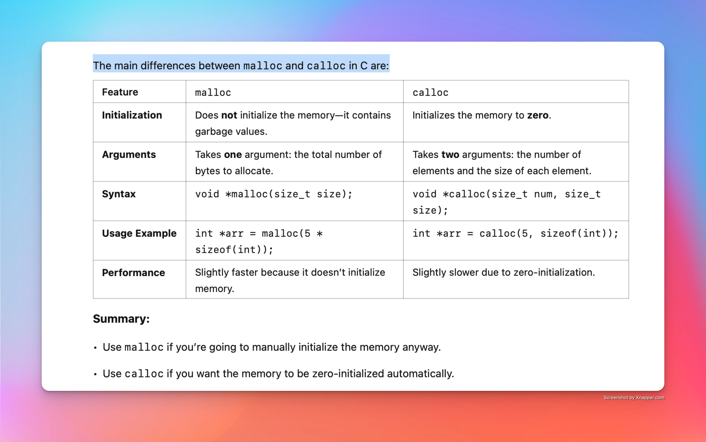

## use malloc()to allocate the array dynamically

#include <stdio.h>
#include <stdlib.h>

int main(woic){
    int n, i, *ptr, sum = o
    
    ptr = (int *)malloc(n*sizeof(int))

}

## using calloc() to create array
difference between malloc and calloc:

#include <stdio.h>
#include <stdlib.h>

int main() {
    int i;

    // malloc example
    int *malloc_array = (int *)malloc(5 * sizeof(int));
    printf("malloc array (uninitialized):\n");
    for (i = 0; i < 5; i++) {
        printf("%d ", malloc_array[i]); // likely garbage values
    }
    printf("\n");

    // calloc example
    int *calloc_array = (int *)calloc(5, sizeof(int));
    printf("calloc array (zero-initialized):\n");
    for (i = 0; i < 5; i++) {
        printf("%d ", calloc_array[i]); // should print 0s
    }
    printf("\n");

    // Free memory
    free(malloc_array);
    free(calloc_array);

    return 0;
}
ptr = (int *)calloc(n, sizeof(int))

## Pointers & Dynamic Memory II

